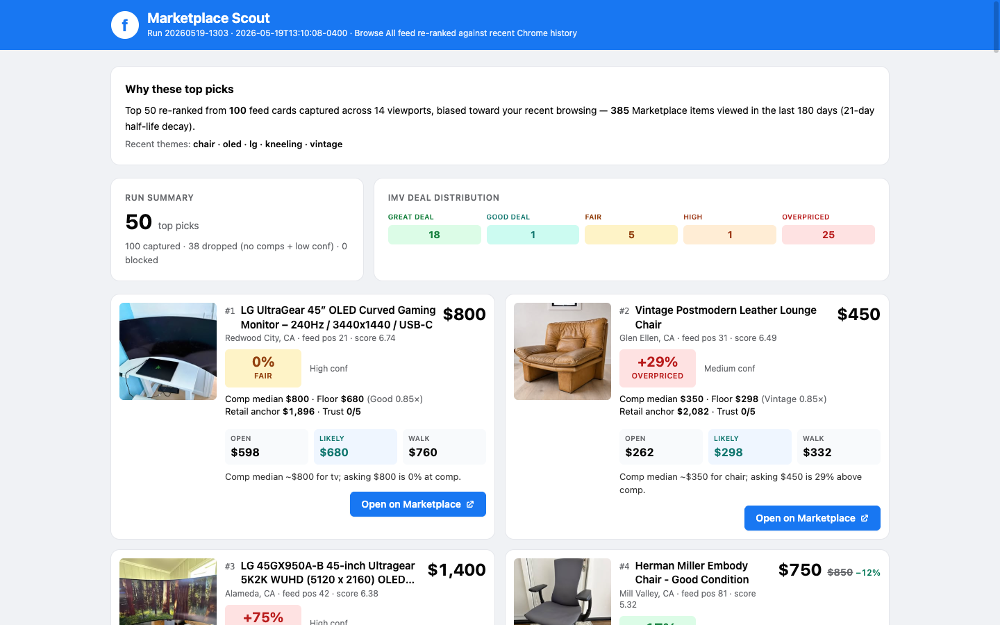
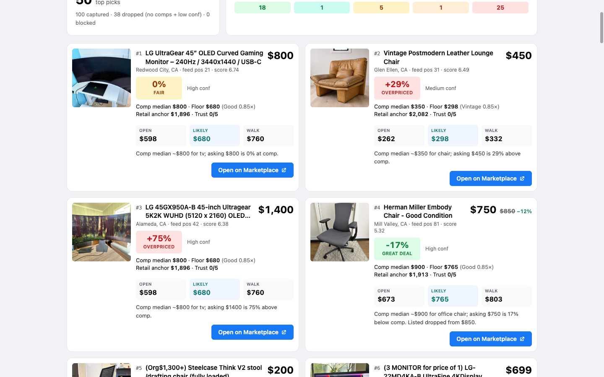
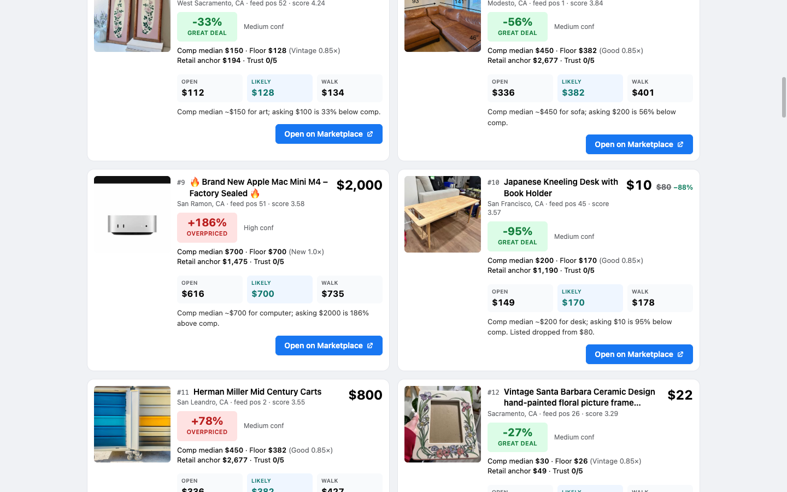
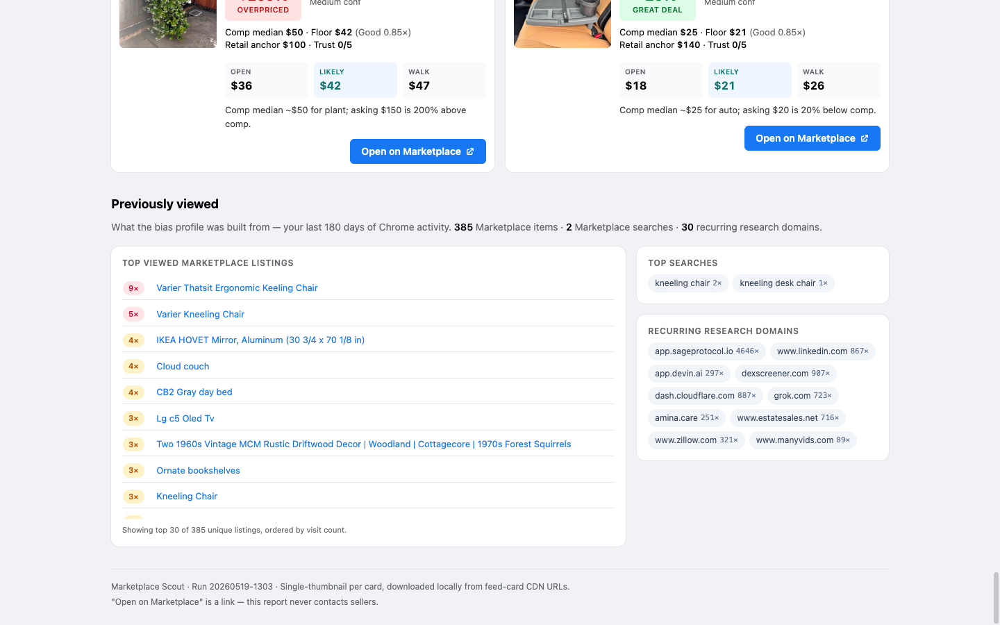

# Marketplace Scout

An agent-led skill library for Facebook Marketplace — Chrome-history-biased feed scrolling, IMV/SCOPE price analysis, and a Facebook-themed HTML digest.

Marketplace Scout pairs the algorithmic Browse-All feed with your own recent Chrome history (180-day window, 21-day half-life decay), scores each surfaced listing against 90-day local comps using the IMV/SCOPE pricing stack, and writes a single-file HTML report you can open in a browser. From there, optional seller-communication stages draft outreach with per-message approval — never standing approval, never unattended sends.

## What it looks like

The scout report is a hand-authored HTML file the agent writes after each Stage-0 run. It re-ranks the Browse-All feed against your recent Chrome history (180-day window, 21-day half-life recency decay) and shows the top 50 in a Facebook-themed digest with IMV deal labels and offer ladders.



Each card shows the asking price, strikethrough MSRP (when known) with saving %, the IMV verdict block (Great / Good / Fair / High / Overpriced), comp median, condition floor, retail anchor, offer ladder, and a button-style "Open on Marketplace" CTA.



The report packs 50 cards in a 2-column grid on wide screens; deal-label colors make scanning fast.



A "Previously viewed" section at the bottom surfaces the Chrome-history listings the bias profile was built from — sorted by visit count, with cleaned titles linking back to the original listings.



Browse a synthetic-data demo at [examples/example_scout_report.html](examples/example_scout_report.html).

## Quickstart

This library has no daemon and no background process. Each run is invoked from a coding-agent session (Hermes, Claude Code, Codex, etc.) attached to this repo.

1. Install `browser-harness` per its project docs and put it on `PATH`.
2. Attach to your logged-in Chrome once: `browser-harness --setup`.
3. Verify the runtime: `browser-harness --doctor` should report Chrome reachable and the daemon alive.
4. Sign into Facebook in that Chrome session.
5. From an agent session in this repo, invoke the buyer skill with a request like
   *"scroll the Marketplace feed and show me a report."* The agent loads
   `skills/commerce/facebook-marketplace-buyer/SKILL.md`, routes to the
   right stage, and writes the report to `reports/current_scout_report.html`.

## How it works

A single end-to-end loop, agent-driven through `browser-harness` (CDP). No persisted Python orchestrators — only ephemeral heredoc snippets the agent runs in the moment.

1. **History → bias.** Chrome's local `History` SQLite is read directly. The last 180 days of `visits` get a recency weight on a 21-day half-life exponential decay. The result is a `seen_listings` / `seen_searches` / `recurring_domains` / `title_vocab` bias profile written to `reports/bias_<run_id>.json`.
2. **Browse-All scroll.** The agent drives `browser-harness` to scroll the un-filtered Marketplace Browse-All feed for up to 14 viewports, capturing up to 100 listing cards plus element-scoped screenshots and thumbnails (downloaded to `reports/images/feed_<run_id>/` so links never expire).
3. **Filter.** A local block list at `reports/.scout_block_list.txt` removes user-blocked sellers and titles. A quality filter drops cards with no comps and low confidence, $0 prices, and empty titles.
4. **IMV / SCOPE per card.** Each surviving card is scored against the six-field pricing stack: `comp_median_90d`, `imv_delta_pct`, `sell_through_rate`, `condition_multiplier` + `adjusted_floor`, `depreciation_anchor` + `dep_years`, `trust_signal_score`. Each card gets one of five verdict bands: Great / Good / Fair / High / Overpriced.
5. **Report.** The agent hand-authors a single-file HTML digest at `reports/current_scout_report.html` — Facebook visual language, top 50 cards in a 2-column grid, colored IMV verdict blocks, strikethrough MSRP + saving %, 3-cell offer ladder (Open / Likely / Walk), 140 px thumbnails, and a "Previously viewed" tail rendered from the bias profile.

## Skills

The library ships these top-level installable skills under `skills/commerce/`:

- `facebook-marketplace-buyer` — buyer-side coordinator; routes the session through Stage 0–6
- `facebook-marketplace-seller` — seller-side coordinator; intake → draft → publish → inbox triage → heartbeat
- `facebook-marketplace-history-seed` — Chrome history → recency-weighted bias profile
- `facebook-marketplace-seller-communication` — drafts seller messages; **per-message approval gate**
- `facebook-marketplace-watch-notifier` — Stage 2 watch + notify (cadence is harness-owned, not in scope here)

Internal stage references the umbrella skills route to, under `skills/commerce/facebook-marketplace-buyer/references/local/`:

- `facebook-marketplace-feed-scroll` — Stage 0 ambient discovery
- `facebook-marketplace-scout` — Stage 1 topic-driven scout
- `facebook-marketplace-deal-assessor` — IMV/SCOPE pricing logic
- `facebook-marketplace-report-generator` — agent-authored HTML
- `facebook-marketplace-negotiator` — offer ladder, seller posture interpretation
- `facebook-marketplace-pickup-manager` — pickup timing, safety, last-mile
- `facebook-marketplace-ui` — selector / URL / extraction reference

## Approval policy

This library is approval-bounded, not unattended. The model is:

**Allowed without approval** — search and ranking, pricing logic, shortlist generation, drafting messages, planning routes, updating local deal-state notes.

**Explicit user approval required** — first seller message, counteroffer, sharing phone number, confirming pickup time, confirming pickup location, saying the user is definitely buying, sending any prefilled default opener.

**Never allowed automatically** — deposits, payments, moving to off-platform payment rails, disclosing sensitive identity details.

See `skills/commerce/facebook-marketplace-buyer/SKILL.md` for the full gate list and the stage-by-stage routing rules.

## Privacy

The bias profile is derived from your local Chrome history and stays on your machine. Everything under `reports/` is local-only and gitignored — bias profiles, feed captures, downloaded thumbnails, the scout block list, and any rendered reports. Only the synthetic `examples/example_scout_report.html` ships in the public repo.

## Repo structure

```
skills/commerce/
  facebook-marketplace-buyer/
    SKILL.md
    references/local/    # stage-specific playbooks
  facebook-marketplace-seller/
  facebook-marketplace-history-seed/
  facebook-marketplace-seller-communication/
  facebook-marketplace-watch-notifier/
docs/
  facebook-marketplace-ui-runbook.md
  state-management.md
  screenshots/           # README assets (tracked)
scripts/                 # smoke tests, structure validators
examples/
  example_scout_report.html
reports/                 # local run outputs (gitignored)
```

## Contributing

Issues and PRs welcome. The library is approval-bounded by design — keep that constraint when proposing changes. New stages, selectors, or pricing inputs should preserve the per-message approval gate for any seller-facing action.

## License

MIT. See [LICENSE](LICENSE).
